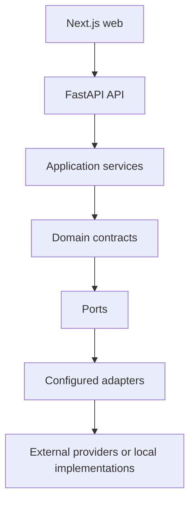

# Provider and integration boundaries

**Status:** M1 boundary contract and future extension guide
**Product:** Entrega Clara
**Related:** [system boundaries](system-boundaries.md), [routing contract](routing-contract.md), [M1 design](../superpowers/specs/2026-09-01-milestone-1-core-delivery-loop-design.md), [platform build research](../research/2026-09-01-platform-build-research.md)

This document explains where external technology is allowed to enter the system. It is intended to keep future development replaceable and to prevent vendor SDKs, browser-only state, or provider payloads from becoming the domain model.

## Boundary rule



The domain depends on ports and stable internal data types. Adapters depend on provider SDKs or protocols. Configuration selects one adapter at startup. A provider response is mapped at the adapter boundary and is never returned directly from a domain method or leaked into a public API response.

## Port and adapter matrix

| Port | M1 implementation | Future implementations | Source of truth |
| --- | --- | --- | --- |
| `IdentityResolver` | Seeded demo identity | OIDC session, service account, support impersonation with audit | Auth/session boundary |
| `Repository` / `UnitOfWork` | In-memory | SQLAlchemy/PostgreSQL, read model, archival store | Application transaction |
| `PaymentGateway` | Deterministic simulator | Mercado Pago, Stripe, other regional providers | Verified server/provider status |
| `RouteSolver` | Local A* over versioned graph | Dijkstra, exact/heuristic solvers, road-router adapter | Solver result + graph version |
| `MapRenderer` | Fake/static fallback in tests | MapLibre GL + MapTiler or another tile provider | Frontend visualization only |
| `EventPublisher` | In-process post-commit hub | Transactional outbox, Redis Streams, managed broker | Committed domain event |
| `NotificationSender` | In-app notification record | Email, push, SMS, chat provider | Notification intent + delivery status |
| `Clock` | Seeded deterministic clock | System clock, test clock, scenario clock | Command/application context |
| `IdGenerator` | Stable fixture or local generator | UUID/ULID service, database IDs | Aggregate/event identity policy |
| `Geocoder` | Seeded addresses only | Provider adapter or self-hosted service | User-confirmed address record |
| `Metrics/Tracing` | Correlation IDs and counters | OpenTelemetry exporter/collector | Observability pipeline |

## Application boundary

The API layer is responsible for:

- HTTP routing, request parsing, and response serialization;
- resolving the identity context;
- calling an application command/query;
- translating domain errors into the stable error envelope;
- opening and closing an SSE connection;
- applying request limits, CORS, and authentication middleware.

The API must not:

- calculate order totals inline;
- write directly to ORM tables outside a repository/application service;
- use a browser-supplied role as authorization;
- call a payment/map/notification provider directly from a route handler;
- expose provider response bodies or stack traces;
- run a long-lived database transaction for an SSE stream.

## Domain boundary

The domain/application layers own:

- aggregate invariants and state transitions;
- money and time semantics;
- coupon eligibility and order totals;
- authorization decisions based on `IdentityContext` and resource scope;
- provider-neutral payment, route, tracking, notification, and event types;
- command idempotency policy;
- event/audit intent.

The domain must not import:

- FastAPI, Starlette, Next.js, React, MapLibre, or MapTiler;
- SQLAlchemy models or sessions;
- Stripe, Mercado Pago, Redis, Celery, OpenTelemetry exporters, or vendor SDKs;
- browser-specific types;
- environment variable reads.

## Persistence boundary

Repositories should expose application-oriented operations rather than generic ORM access. For example, a checkout service should be able to load a cart, apply a coupon, create an order snapshot, create a payment attempt, append an audit event, and commit one unit of work. It should not need to know table joins or SQLAlchemy session mechanics.

Every repository implementation must pass the same contract tests for:

- create/read/update behavior;
- transaction commit and rollback;
- ownership filtering;
- optimistic version conflicts;
- idempotent checkout;
- scenario reset isolation;
- event/audit/notification consistency.

The in-memory adapter is not a fake with different rules. It is a second implementation of the same application contract.

## Payment boundary

### Stable internal contract

The internal payment model should contain only:

```text
PaymentAttempt
- id
- order_id
- method: pix | card | wallet
- status: created | processing | approved | declined | requires_action | refunded
- safe_reference
- failure_code (optional)
- idempotency_key_hash
- created_at / updated_at
```

`safe_reference` is opaque and provider-neutral. It must not contain a card number, CVV, client secret, access token, or unredacted provider payload.

The gateway port should express operations such as:

```text
create_attempt(order, payment_request, idempotency_key) -> PaymentResult
get_status(safe_reference) -> PaymentResult
cancel_or_refund(safe_reference, amount) -> PaymentResult
```

M1 implements those operations deterministically. A future provider adapter handles credentials, request signing, provider statuses, and webhook mapping internally. The order service remains responsible for deciding what payment status means for order state.

### Provider integration rules

- Payment creation is server-side.
- The same idempotency key cannot create two internal attempts for one checkout.
- Webhook signatures are verified before mapping an event.
- Webhook event IDs are deduplicated.
- Browser redirects are informational; verified server/provider state is authoritative.
- Provider timeouts produce a `processing` or recoverable failure state, not an invented approval.
- Refunds and chargebacks are explicit future state transitions.
- Provider secrets live in a deployment secret store and are absent from fixtures/logs.

## Map and geospatial boundary

### Stable internal contract

The backend returns provider-neutral geometry and metrics:

```text
RouteResult
- route_id
- graph_id / graph_version
- ordered_stop_ids
- segments: [origin → stop, stop → stop, ...]
- geometry: GeoJSON LineString or a versioned equivalent
- distance_meters
- estimated_seconds
- solver_name / solver_version
- computation_time_ns
- nodes_expanded
- warnings
```

The web map adapter consumes this result. It may render it with MapLibre GL and MapTiler, but the result remains usable by a static map, a test renderer, or another provider.

### Provider rules

- MapTiler browser keys are public configuration, not backend secrets.
- Browser keys are restricted by origin/referrer and monitored for quota.
- Map attribution is visible on every provider-backed map surface.
- A MapTiler failure never blocks checkout or the order timeline.
- A service token is backend-only.
- External directions/ETA are not silently substituted for the local solver.
- Any OSM-derived graph or data import has a documented license/attribution/update plan.

## Identity and authorization boundary

`IdentityContext` should carry:

```text
identity_id
role
market
organization_id (future-capable)
permissions/scopes
source: demo | oidc | service
```

Application authorization checks the context against the resource. Examples:

- a customer can read/mutate their own cart and orders;
- a restaurant operator can act only on their restaurant's orders;
- a courier can act only on their own availability, offers, delivery, and location;
- operations can read cross-role operational projections but cannot mutate M1 state;
- a demo identity cannot be used in a non-demo environment.

The frontend role switcher is only a way to choose a local identity. It is not an authorization mechanism.

For future accounts, use an external OIDC/OAuth provider and map claims into `IdentityContext`. Keep provider-specific claims out of domain entities. Session rotation, token validation, logout, recovery, and impersonation auditing are separate security work.

## Event and notification boundary

Domain events describe committed business facts. Notifications are projections for a user. A notification is not a second source of order truth.

```text
command → transaction: order + audit + event intent + notification intent
commit → event publisher/SSE
future: commit → outbox → workers/providers
```

Event consumers must tolerate duplicate delivery. Event payloads are versioned and redacted. The SSE client receives only events authorized for the connected identity and order scope.

## Geocoder and address boundary

M1 uses seeded addresses and does not accept arbitrary production addresses. A future geocoder must define:

- provider and data licensing;
- request rate limits and caching;
- user confirmation before saving a result;
- correction/normalization behavior;
- storage of the minimum address needed for delivery;
- retention and deletion behavior;
- whether precise coordinates can be shown to a courier and for how long.

Do not send a full personal address to a third-party provider without a documented purpose, legal/privacy review, and user-facing policy.

## Configuration boundary

Configuration is read once at startup and validated. Recommended names are:

| Variable | Visibility | M1 default/behavior |
| --- | --- | --- |
| `APP_ENV` | Server | `development` |
| `APP_NAME` | Server | `Entrega Clara` |
| `PERSISTENCE_MODE` | Server | `memory`; `postgres` opt-in |
| `DATABASE_URL` | Server secret/config | Required only for Postgres mode |
| `DEMO_MODE` | Server | `true` locally; false for authenticated deployment |
| `DEFAULT_LOCALE` | Server/client config | `pt-BR` |
| `DEFAULT_CURRENCY` | Server/client config | `BRL` |
| `MAPTILER_API_KEY` | Browser-visible, restricted | Optional; map fallback without it |
| `MAPTILER_STYLE_URL` | Browser-visible | Selected public style |
| `PUBLIC_WEB_ORIGIN` | Server | Used for CORS/redirect policy |
| `TRACKING_UPDATE_INTERVAL_SECONDS` | Server | Deterministic simulator setting |
| `LOG_LEVEL` | Server | `INFO` locally |
| `PAYMENT_PROVIDER_SECRET` | Server secret | Absent for M1 simulator |
| `OIDC_CLIENT_SECRET` | Server secret | Absent for M1 demo identity |

Do not use the same variable name for browser-visible configuration and backend secrets. `.env.example` may show names and safe local values but never real credentials.

## Adapter implementation checklist

When adding an external integration:

1. Define or refine the provider-neutral port and internal value objects.
2. Add a fake/in-memory adapter with deterministic tests.
3. Add a provider adapter in its own module/package.
4. Map provider errors and statuses into stable internal errors/states.
5. Document credentials, scopes, quotas, billing, attribution, retention, and failure modes.
6. Add idempotency, retry, timeout, and deduplication behavior.
7. Add metrics and correlation IDs without sensitive payloads.
8. Add an unavailable/degraded UI state.
9. Add sandbox/contract tests; do not make CI depend on live credentials.
10. Update the relevant ADR, requirements traceability, runbook, and public limitations.

## Non-negotiable future safeguards

- No provider SDK in domain code.
- No secret in source, seed, image, browser bundle, or log.
- No client-only permission decision.
- No unbounded provider retry.
- No external provider as the only path for the demo.
- No real personal data in a public fixture.
- No claim of production compliance or uptime without evidence.
