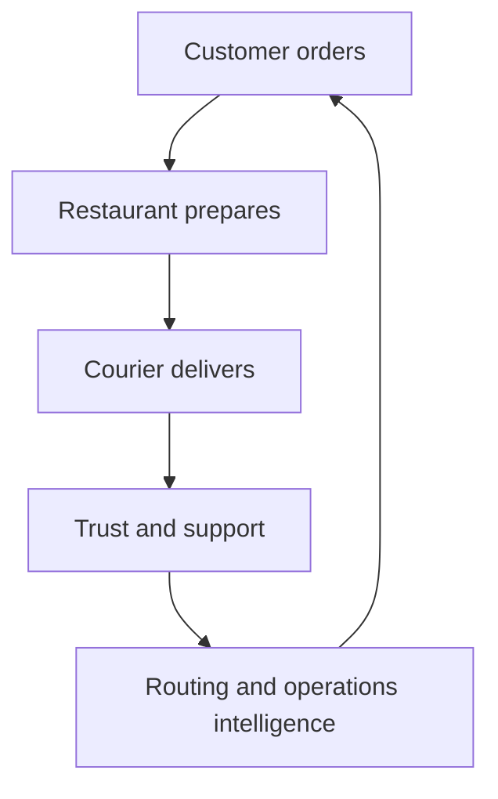

# Entrega Clara platform evolution roadmap

**Status:** Planned sequence after research baseline
**Date:** 2026-09-01
**Current anchor:** [Milestone 1 core delivery loop](../superpowers/specs/2026-09-01-milestone-1-core-delivery-loop-design.md)
**Research basis:** [Platform build research](../research/2026-09-01-platform-build-research.md)

This roadmap describes the order in which Entrega Clara should become a credible food-delivery product and routing portfolio. It is intentionally dependency-driven. The repository may contain scaffolding for a later phase, but a phase is not complete until its user-visible behavior, boundary contracts, tests, and documentation are all present.

The earlier seed document described a smaller “Milestone 1 — Customer ordering” and separate restaurant/courier milestones. The user-approved M1 design expands M1 to the complete core delivery loop. This roadmap uses that newer decision as the execution baseline; the older numbering remains historical context.

## North-star product loop



The product story and the routing thesis must reinforce each other. A routing experiment that is not connected to a delivery, and a delivery flow that cannot expose its route assumptions, are incomplete portfolio evidence.

## Stage overview

| Stage | Outcome | Primary proof |
| --- | --- | --- |
| M1 | Complete deterministic order-to-delivery loop | One order works through customer, restaurant, courier, map/tracking, and operations surfaces |
| M2 | Trust and real identity foundation | Ownership is real, post-delivery feedback/support and account history are coherent |
| M3 | Routing intelligence laboratory | Legacy and replacement solvers are compared on the same delivery problems |
| M4 | External provider integrations | Payments, maps/geocoding, and notifications have verified adapters and failure handling |
| M5 | Durable operations and scale | Outbox, workers, observability, recovery, and deployment are credible |
| M6 | Market expansion and portfolio release | A reviewer can understand, run, evaluate, and trust the product |

## M1 — Core delivery loop

### Goal

Turn the existing scaffold into one complete vertical slice:

```text
discover → menu → cart → coupon → simulated checkout
→ restaurant confirmation/preparation → courier assignment
→ route generation → simulated location → delivered
```

Reviews and ratings are intentionally not part of M1. They begin in M2.

### Work packages

| Package | Scope | Exit evidence |
| --- | --- | --- |
| M1.0 Runtime foundation | SQLAlchemy/Alembic dependencies, configuration, repository ports, memory transaction semantics, Postgres health/migration strategy | Memory and Postgres repository contract tests; `PERSISTENCE_MODE=memory` needs no DB |
| M1.1 Catalog and cart | Restaurants, menus, availability, market formatting, cart commands, coupon rules | Customer can search, inspect, edit cart, and see authoritative totals |
| M1.2 Checkout and payment simulation | Order/item snapshots, totals, payment attempt state, idempotency, safe decline | Approved and declined paths; duplicate checkout cannot duplicate an order |
| M1.3 Restaurant operations | Restaurant queue, confirmation, preparation, ready-for-pickup commands | Authorized restaurant operator advances the shared order |
| M1.4 Courier operations | Availability, one active offer, acceptance, pickup, start, location, complete | Authorized courier completes the delivery and cannot take another active M1 delivery |
| M1.5 Route and map | Versioned synthetic graph, A*, Dijkstra oracle, GeoJSON result, MapLibre/MapTiler adapter, fallback | Route order is correct; map is optional; attribution/key restrictions are documented |
| M1.6 Events and tracking | Event envelope, audit/notification projections, SSE snapshot/stream, deterministic simulator | Reconnect restores snapshot; timeline remains useful without provider/network |
| M1.7 Operations and hardening | Read-only operations view, errors, accessibility, E2E, docs, seed safety, CI | Full happy path plus negative cases passes in both persistence modes |

### M1 definition of done

- A seeded demo identity and a dynamic customer can complete the same application-command path.
- Customer, restaurant, courier, and operations surfaces observe the same order record.
- The order reaches `delivered`; `rated` remains available in the domain but is not required in M1.
- Memory and PostgreSQL adapters satisfy the same contract tests.
- The local route has two legs and records solver/version/metrics.
- MapTiler failure does not block checkout, status, or delivery.
- SSE is authenticated/authorized and snapshot-based on reconnect.
- Scenario reset does not erase dynamic orders.
- Errors are stable, friendly, correlated, and free of internals.
- M1 docs and requirements traceability identify what is implemented versus deferred.

### M1 explicit deferrals

- reviews and ratings;
- real authentication;
- real payment processing;
- external geocoding or provider directions;
- multiple active deliveries, capacity, batching, time windows, and dispatch optimization;
- push/SMS/email notifications;
- support chat;
- full admin mutations;
- native mobile apps;
- durable cross-process event delivery.

## M2 — Trust, identity, and product completeness

### Goal

Make the delivered order useful after delivery and make role boundaries represent real accounts rather than seeded identities.

### Scope

- user profile and preferences;
- real session and account lifecycle through a selected OIDC provider;
- server-side role and ownership enforcement for authenticated users;
- order history with pagination and privacy-aware projections;
- reviews and ratings for restaurant and courier;
- cancellation/refund policy and state transitions;
- support conversations, messages, and support queue;
- richer notification preferences;
- audit inspection filtered by actor, order, and time;
- export/delete demonstration where the data model supports it.

### Prerequisites

- M1 order and delivery aggregates are stable;
- error envelope and correlation IDs are stable;
- provider-neutral payment references already exist;
- data classification, retention, and authorization rules are reviewed;
- an identity provider and session model are selected.

### Exit evidence

- a real authenticated user can see only permitted account/order data;
- a delivered order can be reviewed once under clear rules;
- support and refund/cancellation actions are audited;
- account deletion/export behavior is tested in a non-production environment;
- seeded demo mode remains available but cannot bypass production authorization.

### Research/implementation notes

Use Authorization Code + PKCE and secure server-side sessions. Do not add password storage as a side feature. See the identity section of the [build research](../research/2026-09-01-platform-build-research.md).

## M3 — Routing intelligence laboratory

### Goal

Demonstrate the progression from the original university implementation to a measured, explainable replacement.

### Scope

- stable `RouteProblem` and `RouteResult` input/output contracts;
- legacy brute-force TSP baseline with bounded instance sizes;
- Dijkstra and A* pathfinding comparison;
- exact/branch-and-bound or dynamic-programming solver for small instances;
- nearest-neighbor plus 2-opt heuristic for practical multi-stop routes;
- pickup-before-drop-off precedence;
- courier capacity and time-window constraints;
- multi-stop delivery scenario;
- solver benchmark table and charts;
- algorithm-laboratory UI using the same domain contract as courier operations;
- route reproducibility metadata and benchmark methodology.

### Prerequisites

- M1 live route already consumes a solver-independent result;
- graph versioning and geometry serialization are stable;
- route tests have an oracle and do not depend on a provider;
- benchmark timing excludes browser/network work.

### Exit evidence

- live courier flow uses a replacement solver where the product claims it does;
- legacy and replacement solvers receive the same bounded inputs;
- results report distance, time, work performed, assumptions, and warnings;
- the UI explains pathfinding, route optimization, and dispatch as different problems;
- no factorial benchmark is allowed to run unbounded in a browser request.

### Deferred within M3

Nationwide road data, live traffic, fleet-scale vehicle routing, dynamic rerouting, and provider parity remain separate investigations.

## M4 — External provider integrations

### Goal

Replace selected simulations one boundary at a time while preserving domain behavior and safe degradation.

### Candidate integrations

| Capability | Candidate direction | Required design work |
| --- | --- | --- |
| Brazilian payments | Mercado Pago candidate for PIX/cards | webhook signature verification, idempotency, status reconciliation, merchant/test environment |
| International payments | Stripe candidate | PaymentIntent lifecycle, webhooks, refunds, regional availability, settlement |
| Map tiles/styles | MapTiler remains a candidate | restricted browser key, attribution, quota, billing, fallback |
| Geocoding | provider not selected | privacy, caching, rate limits, address correction, legal terms |
| Real-road route | OSRM/self-hosted or another provider | data source/license, graph freshness, latency, cost, route reproducibility |
| Notifications | email/push/SMS provider not selected | opt-in, templates, delivery retries, provider failure, privacy |

### Integration rule

One provider adapter can be replaced without changing domain commands or the web experience. External status is never accepted from an unverified browser redirect. Webhooks are authenticated, deduplicated, retried, and reconciled.

### Exit evidence

- each enabled provider has sandbox tests and a documented unavailable state;
- secrets exist only in the deployment secret store;
- provider payloads are mapped into stable internal contracts;
- failed/replayed webhooks do not duplicate state changes;
- public documentation clearly distinguishes simulated and real paths.

## M5 — Durable operations and scale

### Goal

Make asynchronous work and production operation credible without turning the project into a distributed system before it needs one.

### Scope

- transactional outbox;
- durable event log and consumer idempotency;
- background workers for notifications, webhooks, and long route jobs;
- Redis Streams or a selected queue/broker only where justified;
- horizontally safe SSE fan-out;
- rate limiting and abuse controls;
- cache strategy and invalidation rules;
- PostGIS only for actual spatial query/road data needs;
- structured logs, traces, metrics, and dashboards;
- PostgreSQL backup/restore and migration rollback procedures;
- readiness/liveness and deployment health checks;
- load/soak/chaos tests for important paths.

### Prerequisites

- M1/M2 commands and event envelopes are stable;
- M4 provider adapters have retry/dedup semantics;
- a deployment target and incident owner exist;
- data retention and operational access rules are documented.

### Exit evidence

- a process crash after commit does not lose a business event;
- workers can retry without duplicate payment/order/notification effects;
- dashboards show command latency, event lag, route latency, errors, and active streams;
- backup restoration is exercised, not merely configured;
- deployment and rollback runbooks have been executed in a non-production environment.

## M6 — Market expansion and portfolio release

### Goal

Make the project easy to evaluate, safe to demonstrate, and structurally ready for another market.

### Scope

- market configuration packs beyond Brazil;
- translations and locale-aware content review;
- currency/tax/fee and address-rule abstractions;
- responsive mobile/PWA behavior;
- WCAG 2.2 AA-oriented audit and remediation;
- browser matrix and visual regression checks;
- deployment with protected environments and secrets;
- screenshots, short demo recording, architecture diagrams, and benchmark narrative;
- dependency maintenance and security review;
- public data/license inventory;
- final README that starts with the product story and explains the routing thesis.

### Exit evidence

- a reviewer can run the seed scenario without private credentials;
- the demo has a reliable degraded path when external services are absent;
- limitations and non-production claims are visible;
- every RF/RNF requirement maps to an implementation or an explicit deferral;
- reproducible tests/build/deployment evidence is attached to the release.

## Cross-stage dependency order

| Capability | First stage | Depends on | Must remain stable for |
| --- | --- | --- | --- |
| Order aggregate and lifecycle | M1 | Domain rules, repository/UoW | M2–M5 |
| Payment attempt abstraction | M1 | Order transaction/idempotency | M4 |
| Identity context port | M1 | API authorization boundary | M2 |
| Route result contract | M1 | Delivery model and graph version | M3–M4 |
| Event envelope | M1 | Transaction/post-commit rule | M2, M4, M5 |
| Outbox | M5 | Stable event IDs and consumers | Notifications/providers |
| Reviews/support | M2 | Delivered order, user identity | M6 |
| Real auth | M2 | Identity context port | All protected surfaces |
| Provider payments | M4 | Simulated gateway contract | M5 reconciliation |
| Real-road routing | M4 | Route adapter and license plan | M5 operations |
| International market | M6 | MarketConfig and localized content | Future markets |

## Change-control rules

Before moving work to the next stage:

1. update the relevant specification and requirements traceability;
2. add or amend an ADR if a boundary or provider decision changed;
3. run the full applicable quality gate;
4. review public data, source links, secrets, and generated artifacts;
5. document what remains simulated or unverified;
6. preserve the deterministic demo path unless the change explicitly replaces it with equivalent evidence.

The roadmap is complete only when the implementation and its explanation tell the same story.
